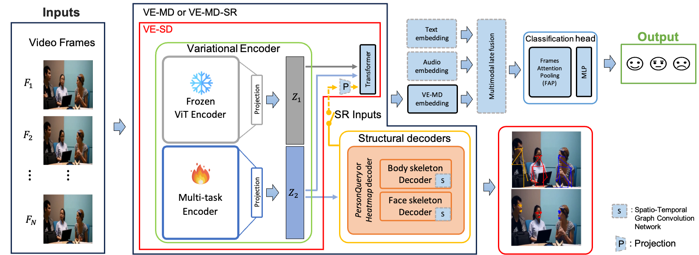
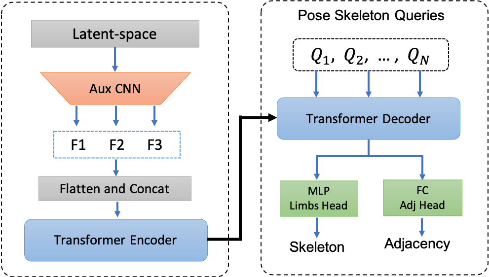
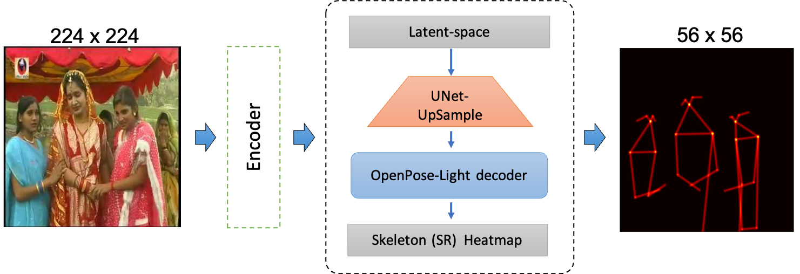
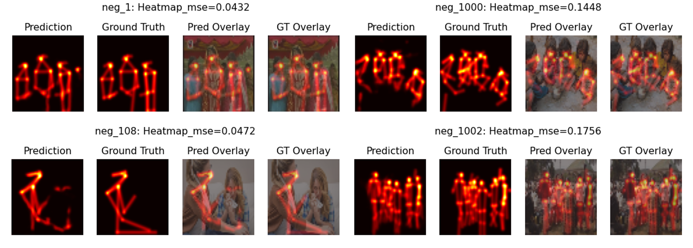
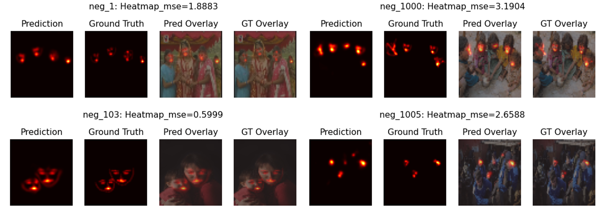
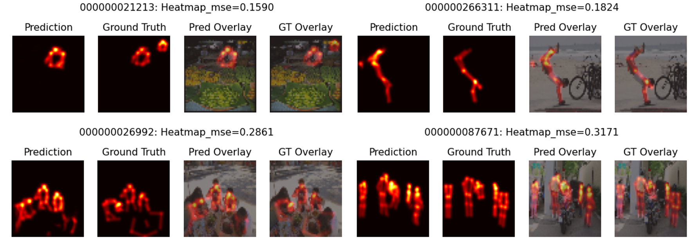
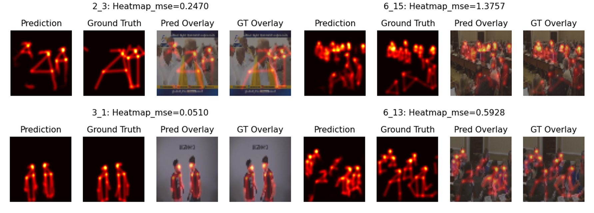

# Variational Encoder–Multi-Decoder (VE-MD) for Privacy-by-functional-design (Group) Emotion Recognition

**VE-MD** jointly learns a shared latent space for **emotion classification** and **structural representations (SR)** (body pose, facial landmarks), with two structural decoders: **PersonQuery** (based on DETR approach) and **Heatmap** (based on OpenPose approach). A frozen **ViT** branch provides global semantics; a trainable multi-task encoder (**ResNet-50** or **Custom Residual**) refines task-specific features.

> Paper: https://arxiv.org/pdf/2604.02397  


## Method Overview

<p align="center">
  
</p>


### Structural Representation (SR) PersonQuery Decoder (DETR approach) Overview 

<p align="center">
  

</p>

### Structural Representation (SR) Heatmap Decoder (OpenPose approach) Overview 

<p align="center">
  

</p>


---

## 📁 Repository Notes

- Most scripts expose CLI arguments via **argparse** (see `run.py`).
- To run “as-is”, you must **set dataset directories** and complete **data preprocessing**.
- **`Mydataloader`** is built for **DDP** in PyTorch to leverage multiple GPUs.
- **`dataset.py`** expects **preprocessed tensors** (`.pt`) for fast loading.
- The **wrapper dataloaders** (`train_loop.py`, `val_loop.py`) let you train **multiple datasets and tasks together**  
  (e.g., detection on Dataset A + classification on Dataset B within the same epoch).

---

## 🧪 Data Preparation

Use the scripts in `data_preprocessing/`. Each script includes inline comments describing usage and expected outputs.  
Ensure your dataset folders and generated `.pt` files align with the paths you pass via CLI (see **CLI options** below).

---

## ⚙️ Environment

Use the provided Conda environment for reproducibility:

```bash
conda env create -f ve_md_env.yml
conda activate ve_md_env

# to train on specific (or fewer) multiple gpus runs the the following CLI command.
# Otherwise all avaible gpus will be used
export CUDA_VISIBLE_DEVICES=0,1,2 # to set devices 0, 1, 2

```
## 🚀 Quick Start

**DETR-based VE-MD on GAF-3.0 (use SR in the emotion decoder)**  

Trains emotion classification + **body SR** prediction. The emotion decoder consumes **latent space + SR** (`--add_keypoints`).

```bash
python run.py \
  --datasets gaf3 \
  --use_person_pose \
  --encoder_name resnet50 \
  --use_mmd \
  --latent_dim 512 \
  --num_epochs 50 \
  --num_queries 100 \
  --add_keypoints \
  --batch_gaf3 32 \
  --LR_emotion 0.0001


```

**Heatmap-based VE-MD on SAMSEMO (latent-only at inference)**

Trains emotion classification + body+face SR prediction, but the emotion decoder uses latent only (no --add_keypoints).
```bash
python run.py \
  --datasets samsemo \
  --decoder_sktname openpose \
  --use_person_pose \
  --use_face_pose \
  --encoder_name resnet50 \
  --use_mmd \
  --use_emotion \
  --latent_dim 512 \
  --batch_samsemo 10 \
  --LR_emotion 0.0001


```

## 🔧 Features 
- Frozen ViT + trainable multi-task encoder (ResNet-50 or Custom Res). 
- Two structural decoders: **DETR** and **Heatmap (OpenPose-style)**. 
- Optional **ST-GCN** temporal modeling in the case of **DETR**.
- **Privacy-aware** “latent-only” inference mode (no structural inputs).

## Examples of Structural Representation (SR) prediction with Heatmap-based

### Body Structural Representation (SR) prediction on GAF-3.0 dataset

<p align="center">
  

</p>

### Face Structural Representation (SR) prediction on GAF-3.0 dataset

<p align="center">
  

</p>

### Body Structural Representation (SR) prediction on COCO dataset

<p align="center">
  

</p>

### Body Structural Representation (SR) prediction on VGAF dataset

<p align="center">
  

</p>


## Acknowledgements
- ViTPose-ONNX
- FaceAlignment
- DETR
- OpenPose

## License
This project is licensed under the MIT License — see the LICENSE file for details.
